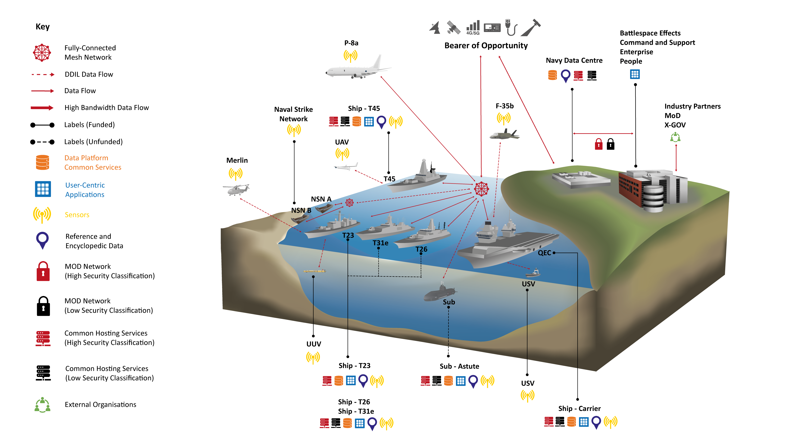
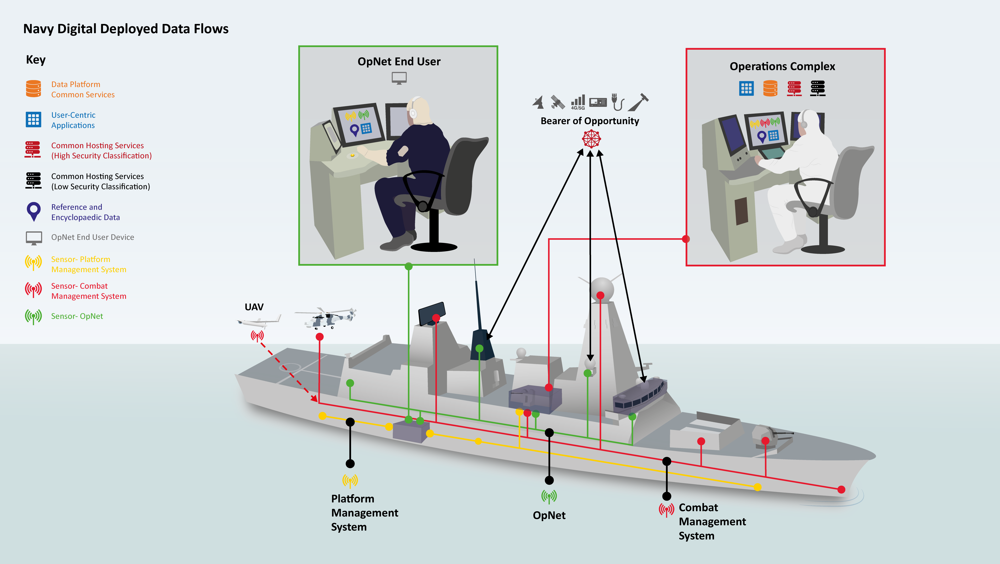
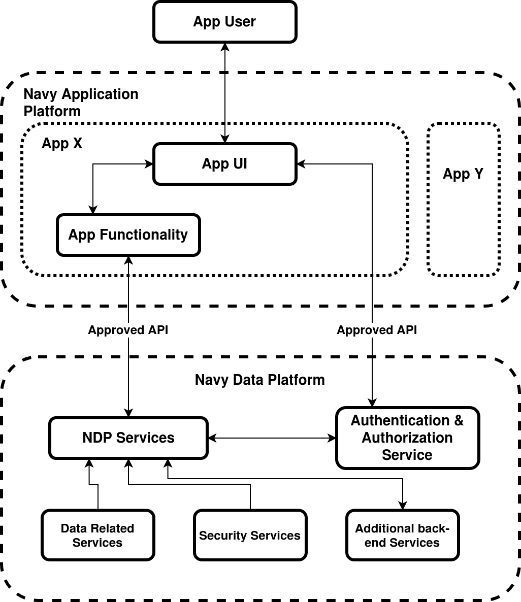

# What is Navy Digital Services?

Navy Digital Services exists to forge a brand new digital, data and artificial intelligence path across the maritime domain. In today's world, data is key, and for the Royal Navy taking advantage of the data collected is vital.

The following clip provides an overview of the reason Navy Digital Services exists:

Digital and Data Transformation with Navy Digital Services. (Video link)

Navy Digital Services has three objectives, which are:

1. To make the Royal Navy’s data coherent and accessible

2. To enable the rapid development and deployment of intelligent applications

3. To grow a culture of digital delivery

In order to meet these objectives and make the Royal Navy's data accessible and coherent we provide a common technology service, tools & standards for digital services. We do this through the Navy Data Platform and the Navy Application Platform which you can read more about later in this guide. This common technology service makes it possible for intelligent applications to be developed and deployed rapidly. On deployment applications are quickly able to exploit the data in the Navy Data Platform, in turn allowing the Royal Navy to draw valuable insight from the data. The images below provide an illustration of how this common technology service and data exploitation can be used across a Royal Navy ship and fleet.

 

To meet the third objective Navy Digital Services guides digital transformations through First Looks & Discoveries to ensure the Royal Navy service users are in the forefront of the transformation.  Further to this we also provide strategy and delivery support teams to provide the support and governance required.

Got a great idea for a new application? The following guide will explain the way the Navy Digital Services platform operates, the technologies utilised and how you can get involved.

## Basic Architecture

At the most fundamental level there are principally two main components of the Navy Digital Services architecture; one aimed at front-end services and one aimed at back-end services. These two areas are broken down into the Navy Application Platform (NAP) and the Navy Data Platform (NDP) respectively. The NAP is there to host Applications and their fundamental capabilities, while the NDP is there to support and deliver most back-end services such as: data storage, authentication, and Eco-System benefits which are discussed later within this document.

Within the NAP, you will find all the Apps being hosted in any given deployment. These Apps are separate from one another and often serve different user groups and production use cases. App users can interact with their app hosted on the NAP through approved routes that are dependent upon the production environment being deployed to.

The Apps hosted on the NAP are then populated and supported by NDP, with whom it interacts through the use of APIs. These APIs give Apps the ability to request and achieve important tasks such as requesting data, authenticating its users, and more.

Below, you will find a very high level architecture generally outlining the NDP and NAP and how they interact with one another. Greater detail around the Approved API communications can be provided as necessary through the NDP SDK documentation.

### Benefits and Advantages

App Teams and other collaborators within Navy Digital Services can leverage a series of Eco-System benefits to ensure more swift development of tools, with a focus on feature delivery through reducing the work required by teams on common challenges. In many programmes, each team must develop their own version of a solution while adhering to standards set elsewhere. Within Navy Digital Services, we ensure that common challenges are commonly solved once, which ensures that other teams can also reap the benefits without themselves having to be responsible for it's delivery or maintenance over time.

Examples of these common Eco-System benefits are shared services such as Access Control and Data Security services. These ensure that each team is able to comply with any Security considerations with minimal upfront effort compared to having to derive their own solution. The shared services on offer changes over time as we support more and more features, however, such examples could include common data ingest tools and App benefits such as data persistence and deployment to name but a few examples.

### Technologies

Within Navy Digital Services we champion Linux based development which leverages both virtualization and containerization. As a result, we are heavily based on a common Linux Distribution and containerization for our development and deployments. The main API for data between the NDP and applications held on the NAP is GraphQL. You can read more below around our deployment methods, container orchestration, clustered infrastructure, and our APIs below.

With regards to what is hosted within our containers, we have a high degree of flexibility with regards to packages, tools, and languages on offer. We highly subscribe the "using the right tool for the job" as long at is adheres to the main architectural principles of the programme. As an example, the use of a C based language could be considered inappropriate without suitable justification for some applications due to us favoring languages such as Python, Scala, Java, and JavaScript, amongst others which are likely to be able to deliver similar functionality in most instances.

### Endpoints

The NDP provides a number of data endpoints which enable the extraction of data from a single location to support deployed applications and data exploration projects within NDS.

The NDP provides a GraphQL API to enable the interaction with semi-structured human readable data. The GraphQL API enables; existing data to be queried, real time streaming data to be subscribed to, and the addition, update and deletion of relevant data through mutations. The GraphQL endpoint can be interacted with by making HTTP requests. These requests are sent to the API as JSON objects with the relevant authentication, where the type of request (read, update, write, delete or subscribing to real-time data) is provided in the JSON key and the corresponding value is a plaintext representation of the corresponding GraphQL request.

The NDP also provides an Open Geospatial Consortium (OGC) API for the exploitation of encyclopedic data. We provide access to several OGC protocols including Web Map Service (WMS), Web Feature Service (WFS), Web Coverage Service (WCS) and Web Map Tile Service (WMTS). The OGC endpoint can be interacted with by making HTTP requests, with the relevant authentication.

All NDP endpoints require a user to verify their identity, this is enabled by a token based authentication which is is provided by the NDP authentication and authorisation service.

## Deployment

Navy Digital Services aims to reduce the overhead of deploying an application into a Navy environment, as such a set of deployment guidelines have been defined to help inform and prepare application developers when building a new Navy Digital application. These guidelines are intended to reduce the dependency matrix of an application while aligning applications with agreed industry practices.

### Navy Application Platform

The Navy Application Platform (NAP) is a scalable, virtualised hosting environment into which applications can be deployed, allowing them to consume the services provided by the Navy Data Platform. Once deployed, applications are made available to end users via a dedicated URL.

### Container Runtime

In using a container runtime it is possible for teams to neatly package up their application plus dependencies, in to a self-sufficient executable artifact known as a Docker Image (or multiple, depending on the complexity of the application).  This simplifies the dependency matrix of the application, requiring only that a Docker engine is installed on the target environment (the NAP).

At a high level, the guidelines for developing a containerised app are:

* Use Docker to package the app up into one or more docker images
* Where available, the official NDS base images should be used as a base layer to your image
* All relevant application configuration should be controllable at runtime
* The deployment of the images should be defined using a docker-compose file

### Operating System

Navy Digital Services champions the use of linux based operating systems. There are a number of motivations for this:

* Culture - Linux typically encourages a community driven approach to developing software
* Tools - Linux provides better compatibility with the tooling of Navy Digital
* Interoperability & flexibility - Linux offers a number of distributions with good levels of compatibility, this allows Navy Digital to more easily migrate to other operating systems as opposed to being locked into a single OS.

It's therefore recommended that new teams also develop their applications on a linux based operating system.

## User Driven Backlog

Within Navy Digital Services we use Agile development and as such our work and backlog is prioritized against the needs of the programme. The NDP team have a dedicated Requirements Manager who ensures our user driven backlog contains any requirements and features requested by those working within the programme. Should you have any particular needs or support for your application or tool, then formal requirements are best raised with the Requirements Manager as soon as is reasonably practicable. Requirements will then be triaged as required by Technical Leads to deliver clarity on the work required such that we can confirm when such requirements can be met by and what they will contain.

## Contact Us

Have a question or require further information? Please contact the NDP team on: navy-data-platform@royalnavy.io.
